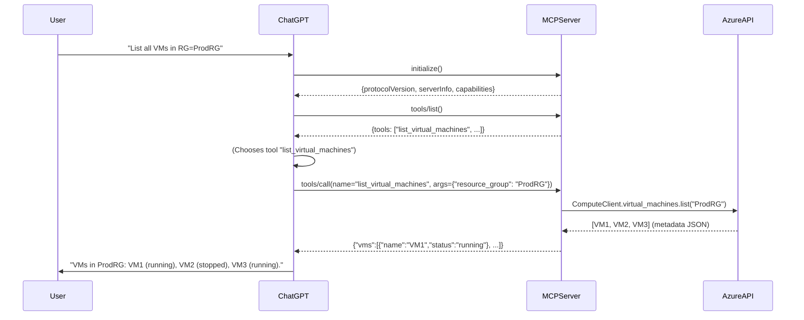

# Executive Summary  

This document specifies the design and architecture of an **Azure Cloud Intelligence MCP Server** – a comprehensive Model Context Protocol (MCP) server that allows ChatGPT Desktop (Developer Mode) to securely query and manage Azure cloud resources via natural language. The solution transforms ChatGPT into an interactive Azure cloud engineer, capable of inspecting subscriptions, deploying resources, troubleshooting issues, and optimizing costs without manual portal navigation. 

The MCP server will expose a rich set of **tools** across multiple Azure domains (Compute, Storage, Networking, Key Vault, Monitoring, Cost Management, Azure OpenAI, Azure AI Foundry, AKS, Functions, SQL, Cosmos DB, Machine Learning, etc.). Each tool performs a specific Azure operation (e.g. list virtual machines, query logs, deploy an OpenAI model) using Azure’s Python SDKs and REST APIs. Authentication is handled via Azure AD credentials (Azure CLI, Service Principal, or Managed Identity) and strict RBAC roles. The architecture uses **streamable HTTP** for connectivity, requiring HTTPS endpoints (or OpenAI’s Secure MCP Tunnel) since ChatGPT Desktop only supports remote servers.  

To develop and operate this system in production, we apply best practices in security (least privilege, Key Vault secrets, audit logging, confirmation flows), scalability (auto-scaling, Azure Container Apps/AKS deployment), and observability (OpenTelemetry, structured logging). This specification covers everything from project vision and detailed flow diagrams to tool inventories, authentication schemes, deployment strategies, and a phased roadmap.

## Problem Statement  

Azure offers a vast array of services and a complex portal/CLI interface. IT teams and DevOps engineers spend countless hours navigating the portal or writing scripts to manage resources. There is a growing need for **conversational cloud management**: allowing users to ask questions or give commands in natural language, and have the system carry out the requested Azure operations. 

Current tools (Azure Portal, CLI, PowerShell) are powerful but manual and disconnected. Chatbots and AI assistants can explain how to do Azure tasks, but cannot act on resources. The MCP protocol bridges this gap: it enables LLMs like ChatGPT to “call functions” that perform real actions. By building a dedicated MCP server for Azure, we let ChatGPT safely inspect, deploy, and fix Azure workloads directly from a chat interface. 

Challenges include ensuring secure Azure access (authentication, least-privilege roles), handling asynchronous and long-running operations, providing clear tool definitions so the AI calls the right function, and maintaining robustness (retry logic, error handling). We must also bridge the architectural difference: **ChatGPT Desktop Developer Mode** requires a *remote* HTTPS endpoint (often via ngrok or a tunnel) rather than the local stdio approach used by some other clients. 

## Goals

### Functional Goals  
- **Natural-language Cloud Management:** Enable ChatGPT to list, create, update, and delete Azure resources (VMs, Functions, SQL DBs, etc.) through simple prompts. For example, asking “Deploy a new AKS cluster named TestCluster” should translate into the correct ARM/Bicep calls and return the result.  
- **Multi-Domain Tools:** Provide tools covering core Azure domains: **Compute** (VMs, VM Scale Sets), **Storage** (Accounts, Blobs, Files), **Networking** (VNets, NSGs, Load Balancers), **Key Vault**, **Monitoring** (Azure Monitor, Log Analytics), **Cost/FinOps** (cost analysis, budgets), **AI Services** (Azure OpenAI, AI Foundry, Azure ML), **Kubernetes (AKS)**, **Serverless** (Functions, Logic Apps), **Databases** (SQL, Cosmos, PostgreSQL, MySQL), and more.  
- **Interactive Insights:** Answer queries by collating live Azure data. Example queries: “Which resource group has the most spend?” or “Why is my VM crashing?” The MCP server can gather metrics/logs across services, analyze them (possibly using Azure ML or other AI), and return diagnostics.  
- **Secure Operations:** Every action must respect Azure RBAC. For example, if ChatGPT is asked to delete a VM, it should confirm the action and ensure the caller has the right role. Sensitive operations require an explicit confirmation step.  
- **Extensibility:** Design the system so that new Azure services and custom enterprise APIs can be added as tools in the future.

### Non-Functional Goals  
- **Scalability:** The server should scale horizontally (e.g. in Kubernetes) and handle many simultaneous ChatGPT sessions. Use **auto-scaling** groups or Azure Container Apps with CPU/memory-based scaling. Implement load-balancing for high availability.  
- **Performance:** Tool calls (especially long-running tasks like deployments) should stream status updates back to ChatGPT (via Server-Sent Events). Use asynchronous Azure SDK calls where possible, and offload heavy tasks to background jobs or serverless where beneficial.  
- **Security:** All traffic must use HTTPS. Secrets (Azure service principals, API keys) are stored in Azure Key Vault or environment-protected vaults. Employ least-privilege principals (see **RBAC** below). Use Azure managed identities in production to avoid embedded secrets.  
- **Observability:** Every tool invocation should be logged (who called it, what parameters, success/failure). Use **OpenTelemetry** for tracing across Azure SDK calls. Send metrics to Azure Monitor or Application Insights. Provide a dashboard for monitoring usage and failures.  
- **Reliability:** Implement retry policies for transient failures (e.g. Azure rate limits or brief outages). Validate and sanitize inputs to avoid unauthorized actions. Include robust error handling to capture and report any unexpected issues to ChatGPT rather than crashing.

### Security Goals  
- **Least-Privilege:** Map each tool’s actions to the minimal RBAC role needed. For example, read-only queries use Reader roles; destructive actions require Contributor or specific action-level roles. Do not use wide roles like Subscription Owner unless absolutely necessary.  
- **Authentication:** Support Azure AD flows: local dev with `DefaultAzureCredential` (which tries Azure CLI or interactive login), and production using **Service Principal** or **Managed Identity**. Example environment variables: `AZURE_TENANT_ID`, `AZURE_CLIENT_ID`, `AZURE_CLIENT_SECRET`.  
- **Confirmation Flows:** For any write action (create/update/delete), ChatGPT must ask user for confirmation before executing (ChatGPT’s UI inherently asks the user to approve tool calls based on app permissions).  
- **Audit Logging:** Log every call with timestamp, user identity (if available via ChatGPT token or API), tool name, arguments, and outcome. Store logs securely (e.g. Azure Log Analytics) for compliance audits.  
- **Data Protection:** Use Key Vault to store any long-lived secrets or config. Encrypt sensitive payloads in transit. Ensure no confidential resource data is leaked (tools should only return necessary outputs, not full secrets).

## System Architecture  

```mermaid
flowchart LR
    subgraph "ChatGPT Desktop (Dev Mode)"
        A[User Chat Interface] 
        B((Developer Mode))
    end
    subgraph "OpenAI Platform"
        C[OpenAI MCP Connector Service]
        D[Tunnel / https.ngrok.app (if used)]
    end
    subgraph "Azure Network"
        E[MCP Server (FastAPI) on host/container]
        F[Azure API Gateway / Identity]
        G[Azure Resources (VMs, AKS, SQL, etc.)]
    end

    A -- User prompt --> B
    B -- *MCP Protocol (JSON-RPC over HTTPS)* --> C
    C -- Forward request --> D
    D -- Forward via tunnel --> E
    E -- Azure SDK/API calls --> F
    F -- Authorizes via Azure AD --> G
    E -- (streamed results) --> C
    C -- results --> B
    B -- Answer to User --> A
```

- **ChatGPT Desktop (Client):** Runs in developer mode and treats our MCP server as a “connector” or app. It sends JSON-RPC calls (`initialize`, `tools/list`, `tools/call`) over **streamable HTTP** to the MCP endpoint.  
- **OpenAI MCP Connector Service:** Depending on context, ChatGPT might connect directly via the public URL (if using ngrok/Cloudflare) or via OpenAI’s **Secure MCP Tunnel** (official outbound tunnel). The diagram shows the tunnel case: `tunnel-client` polls OpenAI and relays requests to the MCP server.  
- **MCP Server:** Implemented in Python (FastAPI + FastMCP). Exposes a single `/mcp` HTTPS endpoint. Handles authentication (verifying incoming JWT/OAuth if used), lists available tools, executes tool handlers. Calls into Azure services using the Azure Python SDK (`azure-mgmt-*`) and `azure-identity` for Azure AD tokens.  
- **Azure Resources:** Actual cloud resources. The MCP server uses Azure Resource Manager (ARM) APIs and service-specific SDKs (ComputeManagementClient, NetworkManagementClient, etc.) to perform actions. Azure AD issues access tokens for the service principal or managed identity under which the server runs.

### Sequence of an Example Request



- **Handshake:** ChatGPT sends `initialize` and expects version info, then `tools/list` to discover available functions.  
- **Tool Invocation:** When ChatGPT chooses a tool, it sends `tools/call` with arguments. The MCP server executes the corresponding Python function, which calls Azure APIs and returns results as JSON or text.  
- **Streaming:** If the operation is long-running, the server can stream intermediate progress back (using Server-Sent Events). ChatGPT will display a loading UI and partial answers as they arrive.

## MCP Fundamentals and Protocol Flow

- **JSON-RPC 2.0:** MCP uses JSON-RPC over HTTP. Requests include an `id`, `method`, and `params`. Key methods: `initialize`, `tools/list`, `tools/call`.  
- **Streamable HTTP:** The server should use a stream-capable transport (HTTP with SSE) to support real-time results. The Python **MCP SDK** (`mcp` package) supports this via `transport="streamable-http"`.  
- **Tool Discovery (`tools/list`):** On startup, ChatGPT lists tools. The server must respond with each tool’s name, description, input schema, etc. The output is a JSON array of tool definitions.  
- **Tool Execution (`tools/call`):** When the model decides to use a tool, the Responses API will output a JSON block of type `mcp_call` showing the tool name and arguments. The server executes the tool and returns the result (JSON or text). ChatGPT then includes this in its final answer.  

Official documentation confirms this flow: each conversation, the model will “first make a request to list available tools from the server” and later “if the model decides to call one of the available tools, you will also find an `mcp_call` output” in the response.

## Tool Inventory

We organize tools by Azure domain. Each tool has a name, description, input schema, output schema, required permissions, possible errors, and SDK library. Below is a representative subset of key tools (the final implementation would include many more). 

| Module            | Tool Name               | Description                      | Inputs (required)                     | Output                          | Required RBAC Role(s)                      | Errors                 | SDK / Service                         |
|-------------------|-------------------------|----------------------------------|---------------------------------------|---------------------------------|-------------------------------------------|------------------------|---------------------------------------|
| **Resource Mgmt** | `list_resource_groups`   | List all resource groups         | – (none)                              | List of RG names                | *Reader* at Subscription scope            | Auth failure<br>APIs errors | `ResourceManagementClient.resource_groups.list()` |
|                   | `create_resource_group`  | Create new resource group        | `name`, `location`                    | Confirmation or RG JSON         | *Contributor* or custom role on RG        | AlreadyExists<br>InvalidName | `resource_client.resource_groups.create_or_update()` |
|                   | `delete_resource_group`  | Delete RG                        | `name`                                | Status message                  | *Contributor* on RG                       | NotFound<br>Dependency      | `resource_client.resource_groups.begin_delete()` |
| **Compute (VMs)** | `list_virtual_machines`  | List VMs in a RG                 | `resource_group`                      | List of VMs with status/info    | *Virtual Machine Contributor* or *Reader*  | RGNotFound               | `ComputeManagementClient.virtual_machines.list()` |
|                   | `get_vm_status`         | Get VM's power state             | `resource_group`, `vm_name`           | State string (e.g. "running")   | *Virtual Machine Contributor* or *Reader*  | VMNotFound               | `compute_client.virtual_machines.get()` |
|                   | `start_vm`             | Start a stopped VM               | `resource_group`, `vm_name`           | Success message                | *Virtual Machine Contributor*             | AlreadyRunning<br>Auth      | `compute_client.virtual_machines.begin_start()` |
|                   | `stop_vm`              | Stop a VM                        | `resource_group`, `vm_name`           | Success message                | *Virtual Machine Contributor*             | AlreadyStopped<br>Auth      | `compute_client.virtual_machines.begin_power_off()` |
|                   | `create_vm`            | Create a new VM                  | `resource_group`, `vm_name`, `size`, `image` | Deployment details        | *Virtual Machine Contributor*             | InvalidParams<br>QuotaExceeded | `compute_client.virtual_machines.begin_create_or_update()` |
| **Storage**       | `list_storage_accounts`  | List storage accounts            | `resource_group`                      | List of accounts names          | *Storage Account Contributor* or *Reader* | RGNotFound               | `StorageManagementClient.storage_accounts.list_by_resource_group()` |
|                   | `create_storage_account` | Create new storage account       | `resource_group`, `name`, `sku`, `location` | Details / confirmation   | *Storage Account Contributor*             | NameTaken<br>InvalidName   | `storage_client.storage_accounts.begin_create()` |
|                   | `upload_blob`           | Upload a blob to a container     | `account_name`, `container_name`, `blob_name`, `data` | URL or status | *Storage Blob Data Contributor*           | NotFound<br>Auth           | `BlobServiceClient.get_container_client().upload_blob()` |
|                   | `download_blob`         | Download a blob's content        | `account_name`, `container_name`, `blob_name` | Blob bytes or text          | *Storage Blob Data Reader*                | NotFound                  | `BlobServiceClient.get_container_client().download_blob()` |
| **Networking**    | `list_virtual_networks`  | List VNets in a RG               | `resource_group`                      | List of VNet names              | *Network Contributor* or *Reader*         | RGNotFound               | `NetworkManagementClient.virtual_networks.list()` |
|                   | `create_network_security_group` | Create NSG               | `resource_group`, `nsg_name`, `location` | Details                       | *Network Contributor*                    | AlreadyExists<br>Auth       | `net_client.network_security_groups.begin_create_or_update()` |
|                   | `list_public_ips`       | List Public IPs in RG           | `resource_group`                      | List of IPs and assignments    | *Network Contributor* or *Reader*         | RGNotFound               | `net_client.public_ip_addresses.list()` |
| **Key Vault**     | `list_secrets`          | List secrets in Key Vault        | `vault_name` (and optionally `resource_group`) | Secret names           | *Key Vault Reader* (for metadata)        | VaultNotFound<br>Auth      | `SecretClient.list_properties_of_secrets()` |
|                   | `get_secret`           | Retrieve secret value            | `vault_name`, `secret_name`           | Secret value (string)           | *Key Vault Secrets User*                  | SecretNotFound<br>Auth    | `SecretClient.get_secret()` |
|                   | `set_secret`           | Create/update a secret           | `vault_name`, `secret_name`, `value`  | Confirmation message            | *Key Vault Contributor*                   | AuthDenied<br>Validation   | `SecretClient.set_secret()` |
| **Monitoring**    | `query_log_analytics`   | Query Log Analytics workspace    | `workspace_id`, `query`               | Query results (JSON)           | *Log Analytics Reader*                    | QueryError<br>Auth         | `LogAnalyticsDataClient.query()` |
|                   | `list_metrics`         | Get metrics for a resource       | `resource_id`, `metric_names`         | Time-series data JSON           | *Monitoring Reader*                      | ResourceNotFound           | `MonitorClient.metrics.list()` |
| **Cost Mgmt**    | `get_cost_summary`      | Show current spend breakdown     | `scope` (e.g. subscription or RG ID)  | Cost figures by category       | *Cost Management Reader*                 | InvalidScope             | Azure Consumption APIs           |
|                   | `get_advisor_recommendations` | Fetch Azure Advisor issues  | `scope` (subscription or RG ID)       | List of recommendations        | *Advisor Reader* or *Contributor*         | NoRecommendations       | Azure Advisor REST API            |
| **Azure OpenAI**  | `list_openai_models`    | List deployed AI models          | `resource_group`, `instance_name`     | Model deployments list        | *Cognitive Services OpenAI User*         | InstanceNotFound          | Azure OpenAI Python SDK           |
|                   | `deploy_openai_model`   | Deploy a new model               | `resource_group`, `instance_name`, `model_id`, `deployment_name` | Success message | *Cognitive Services OpenAI Contributor*  | QuotaExceeded<br>Auth   | Azure OpenAI Python SDK           |
| **AI Foundry**    | `list_ai_agents`        | List AI Foundry agents           | `foundry_project_id` or `resource_id` | List of agent names            | *Foundry Agent Consumer* (for reads)     | ResourceNotFound         | Azure AI Foundry REST API         |
|                   | `start_ai_agent`        | Start/deploy an AI agent         | `agent_id`                            | Task status                    | *Foundry User* or *Foundry Project Manager* | AuthDenied             | Azure AI Foundry REST API         |
| **AKS (Kubernetes)** | `list_aks_clusters`  | List AKS clusters                | `resource_group`                      | Cluster names                 | *Azure Kubernetes Service Contributor*    | RGNotFound               | `ContainerServiceClient.managed_clusters.list()` |
|                   | `get_aks_pods`         | List pods in an AKS cluster      | `resource_group`, `cluster_name`      | Pod statuses                  | *Kubernetes Cluster Admin*                | ClusterNotFound           | `kubernetes` Python client (or az CLI) |
| **Functions**     | `list_functions`        | List Azure Function apps         | `resource_group`                      | Function app names             | *Contributor (Functions)*                 | RGNotFound               | `WebSiteManagementClient.web_apps.list()` |
|                   | `get_function_logs`    | Tail logs of a function app      | `resource_group`, `app_name`, `function_name` | Log text             | *Functions Contributor*                   | AppNotFound             | Azure CLI (`func azure functionapp fetch-stream` or Kudu API) |
| **SQL Databases** | `query_sql_db`         | Run SQL query on Azure SQL       | `server_name`, `database_name`, `query` | Query results rows          | *SQL DB Contributor* or *SQL Security Manager* | QueryError         | `pyodbc` or Azure SQL client      |
|                   | `list_sql_databases`   | List databases on SQL server     | `server_name`                         | DB names                      | *SQL Server Contributor*                  | ServerNotFound           | `SqlManagementClient.databases.list_by_server()` |
| **Cosmos DB**     | `list_cosmos_containers`| List containers in Cosmos DB     | `account_name`, `database_name`       | Container names               | *Cosmos DB Operator*                      | AccountNotFound         | `CosmosClient.read_database()`    |
|                   | `run_cosmos_query`     | Execute query on a Cosmos DB     | `account_name`, `database_name`, `query` | Query results             | *Cosmos DB Operator*                      | QueryError             | `CosmosClient` SDK or REST       |
| **Machine Learning** | `list_ml_models`     | List registered ML models        | `workspace_name`, `resource_group`    | Model names                   | *Machine Learning Contributor*            | WorkspaceNotFound      | `MLClient.models.list()`           |
|                   | `run_ml_pipeline`      | Trigger an ML pipeline or job    | `workspace_name`, `experiment_name`, `pipeline_id` | Run status         | *Machine Learning Contributor*            | NotFound               | `MLClient.jobs.submit()`         |

*Table: Key tools by Azure domain. (In practice, many more tools and granular actions would be implemented.)* 

Each tool’s implementation will use the Azure management SDK or REST API. For example, `ComputeManagementClient`, `StorageManagementClient`, `KeyVaultAdministrationClient`/`SecretClient`, `MonitorManagementClient`, `CostManagementClient`, `OpenAIClient`, `MLClient`, etc. Inputs and outputs should have clear JSON schemas so ChatGPT knows how to format calls. We annotate each tool with the **minimum Azure role** needed. For instance, “list storage accounts” requires at most a **Reader** on the subscription/RG, while “create storage account” requires **Contributor** on that resource group.

## Authentication Options

Three main credential types will be supported:

- **Azure CLI / Developer Login:** For local development, the server can use `DefaultAzureCredential()` or `AzureCliCredential()` from `azure-identity`. This reuses `az login` credentials. Example (Python):
  ```python
  from azure.identity import DefaultAzureCredential
  credential = DefaultAzureCredential()
  subscription_id = os.environ["AZURE_SUBSCRIPTION_ID"]
  ```
  This will check environment variables, managed identity, Azure CLI token, etc. It’s convenient for testing but should not be used in production.

- **Service Principal (Client Secret):** For automation, register an Azure AD app and get its `tenant_id`, `client_id`, `client_secret`. Then use:
  ```python
  from azure.identity import ClientSecretCredential
  credential = ClientSecretCredential(
      tenant_id=os.environ["AZURE_TENANT_ID"],
      client_id=os.environ["AZURE_CLIENT_ID"],
      client_secret=os.environ["AZURE_CLIENT_SECRET"],
  )
  ```
  This uses the ClientSecretCredential flow. Required env vars: `AZURE_TENANT_ID`, `AZURE_CLIENT_ID`, `AZURE_CLIENT_SECRET`, and `AZURE_SUBSCRIPTION_ID`.

- **Managed Identity:** If hosting the MCP server in Azure (VM, App Service, Container Apps, AKS), enable a Managed Identity on the host. Then:
  ```python
  from azure.identity import DefaultAzureCredential
  credential = DefaultAzureCredential()  # will pick up the managed identity automatically
  ```
  (Alternatively, use `ManagedIdentityCredential`). This avoids any stored secrets. The host must have the appropriate Azure role assignments for the needed actions.

### Example Code Snippet

```python
import os
from mcp.server.fastmcp import FastMCP
from azure.identity import DefaultAzureCredential
from azure.mgmt.resource import ResourceManagementClient

# Initialize Azure credentials and clients
subscription_id = os.environ["AZURE_SUBSCRIPTION_ID"]
credential = DefaultAzureCredential()
resource_client = ResourceManagementClient(credential, subscription_id)

# Create the MCP server
mcp = FastMCP("Azure Cloud Intelligence")

@mcp.tool()
def list_resource_groups() -> list[dict]:
    """List all resource groups in the subscription."""
    groups = resource_client.resource_groups.list()
    return [ {"name": g.name, "location": g.location} for g in groups ]

@mcp.tool()
def create_resource_group(name: str, location: str) -> str:
    """
    Create a resource group. 
    """
    rg = resource_client.resource_groups.create_or_update(name, {"location": location})
    return f"Resource group '{name}' created in {location}."

# ... more tool definitions ...

if __name__ == "__main__":
    # Run the MCP server (streamable HTTP transport)
    mcp.run(
        transport="streamable-http",
        host="0.0.0.0",
        port=8000,
    )
```

In production code, add error handling (`try/except` with informative messages) and logging within each tool. All credentials and subscriptions are read from environment or managed identity.

## RBAC and Least-Privilege Roles

We must grant the MCP server’s identity (SPN or MI) the narrowest roles needed. Below is a summary of recommended built-in roles for each area:

| Azure Service        | Minimum Built-in Role(s)              | Justification / Scope                                      |
|----------------------|---------------------------------------|------------------------------------------------------------|
| **Resource Groups**  | Reader (view), Contributor (manage)   | To list RGs, RGroups. (Admin would have Owner but avoid)   |
| **Compute (VMs)**    | *Virtual Machine Contributor*         | Full VM lifecycle operations.                              |
| **Storage (Accounts)**| Storage Account Contributor          | Manage storage accounts.                                   |
| **Storage (Blobs)**  | Storage Blob Data Contributor (or Reader) | Manage blob data if data plane needed.             |
| **Networking**       | Network Contributor                   | Create/read VNet, NSG, LB, etc.                            |
| **Key Vault (Mgmt)** | Key Vault Contributor                 | Create/manage vaults; _does not access secrets data_. |
| **Key Vault (Data)** | Key Vault Secrets User                | Read secret values.                                        |
| **Monitoring**       | Monitoring Reader (or Contributor)    | Read metrics/logs.                                          |
| **Cost Mgmt**        | Cost Management Reader                | View costs/budgets.                                        |
| **Azure OpenAI**     | Cognitive Services OpenAI Contributor (for deploy/edit models) / OpenAI User (for inference) | To deploy and use OpenAI models.                            |
| **Azure AI Foundry** | Foundry User (or Agent Consumer)   | Basic Foundry project access; higher roles for management. |
| **AKS**              | Azure Kubernetes Service Contributor  | Manage AKS clusters.                                       |
| **Functions**        | Contributor (Web App Contributor)     | Manage Function Apps (Functions Contributor also exists).  |
| **SQL**              | SQL DB Contributor / SQL Security Manager | Manage databases (not full server control).        |
| **Cosmos DB**        | Cosmos DB Operator                    | Manage Cosmos DB resources.                                |
| **Azure ML**         | Machine Learning Contributor          | Manage ML workspace and assets.                            |

These roles are based on Azure’s built-in definitions. For example, “Virtual Machine Contributor” lets you create/start/stop VMs (but not modify access policies), while “Virtual Machine Reader” would only list VMs. Avoid giving **Owner** or **Contributor** on the subscription unless needed. 

Developers should assign these roles to the service principal or managed identity *scope-wise* (e.g. at resource group or subscription level). The MCP server’s own app registration does not use these roles directly – they apply to the Azure SPN/MI identity when it acquires tokens. Additional ChatGPT-specific RBAC (workspace admins controlling who can enable the connector) is handled in ChatGPT Workspace Settings, not in this server spec.

## Security Design

- **Authentication & Authorization:** The MCP server requires incoming requests to be authorized. ChatGPT Desktop’s MCP connectors use internal OpenAI auth (they present a JWT or token). In practice, ChatGPT automatically attaches the appropriate ChatGPT token, and the server need only trust ChatGPT by design (there is no public sign-on for the tool’s HTTP endpoint). If OAuth is configured, follow [OpenAI’s guidelines](https://help.openai.com/en/articles/12584461-developer-mode-and-mcp-apps-in-chatgpt) to validate tokens.

- **Sensitive Data:** Do not log sensitive outputs (like secret values) indiscriminately. If a user asks for a secret, consider returning only a placeholder (like masked value) unless explicitly needed, and advise storing secrets in Key Vault.

- **Confirmation Flows:** ChatGPT Developer Mode automatically asks the user to confirm write operations based on the tool’s declared `tool_call_approval_policy`. We should configure write-action tools to require confirmation. For example, the Python MCP SDK allows setting `tool_call_approval_policy` (global or per-tool). By default, write tools should be `RequireApprovalBeforeCall` unless the environment is fully trusted.

- **Key Vault for Server Secrets:** Store any Azure client secrets or API keys in an **Azure Key Vault** and fetch them at runtime. The server should not expose these to logs or error messages.

- **Network Security:** The MCP server should run on HTTPS with a valid certificate. For local testing, use `ngrok http 8000` to get an `https://<token>.ngrok.app` address, or use OpenAI’s Secure Tunnel (which also tunnels TLS). Strict CORS is not needed on server-side (only if embedding in browser).

- **Audit Logging:** Each call to a tool should log the caller identity (which ChatGPT does not supply, but we could log the ChatGPT user if we integrate with an API key), the tool name, parameters, and result status. Use Azure Monitor or an ELK stack for logs. Retain logs for N days per compliance requirements.

## Developer Setup (Local to Production)

1. **Local Development:**  
   - Ensure Azure CLI is installed and logged in (`az login`). Set the active subscription (`az account set --subscription "<ID>"`).  
   - Export environment variables for convenience:  
     ```bash
     export AZURE_SUBSCRIPTION_ID="<your-sub-id>"
     export AZURE_TENANT_ID="<your-tenant-id>"
     export AZURE_CLIENT_ID="<your-SPN-client-id>"
     export AZURE_CLIENT_SECRET="<your-SPN-client-secret>"
     ```  
   - Install Python SDKs: `pip install mcp fastapi uvicorn azure-identity azure-mgmt-resource azure-mgmt-compute ...` and any other `azure-mgmt-*` packages needed (see [Azure SDK docs]).  
   - Write `app.py` or similar with your `FastMCP` server and tools (as shown above).  
   - Run `uvicorn app:app` (or `python app.py`) to start the server on `http://localhost:8000/mcp`.

2. **Tunneling (ngrok) or Secure Tunnel:**  
   ChatGPT Desktop *cannot* directly reach `localhost`. Options:  
   - **ngrok:** Run `ngrok http 8000`. This gives a public `https://abcd.ngrok.app` forwarding to your local `:8000`. Use that URL in ChatGPT.  
   - **Secure MCP Tunnel:** If permitted, configure an OpenAI Tunnel endpoint and run `tunnel-client`. This avoids exposing ngrok and is more secure. See [Secure MCP Tunnel guide].

3. **ChatGPT Desktop Configuration:**  
   - Open ChatGPT, go to **Settings → Advanced → Developer Mode**, and enable it.  
   - Go to **Apps (Connectors)** and click **Create**.  
   - Fill in:
     - Name/Description (e.g. “Azure CLI Tools”).  
     - Endpoint: your exposed URL + `/mcp` path (e.g. `https://abcd.ngrok.app/mcp`).  
     - Authentication: choose “No Authentication” for now (assuming we trust ChatGPT client). If using OAuth2 (for multi-tenant scenarios), configure accordingly.  
   - Click **Scan Tools**. ChatGPT will call `initialize` and then `tools/list` on your server.  
   - Once tools are listed, finalize creating the connector. It will appear in your ChatGPT tools menu (labeled *Dev* or *Custom*).

4. **Test in ChatGPT:**  
   Open a new chat, select your connector, and ask test queries (e.g. “list resource groups”). The assistant will call the tools and return live data. Check server logs for any errors.

## Repository Structure

A recommended project layout is:

```
azure-cloud-intelligence-mcp/
├── docs/
│   ├── architecture.md
│   ├── tools.md
│   ├── security.md
│   ├── deployment.md
│   └── ...
├── src/
│   ├── app.py              # main FastAPI/MCP server entrypoint
│   ├── tools/              # individual tool modules, e.g. compute.py, storage.py
│   ├── auth.py             # Azure auth helpers
│   ├── azure_clients.py    # initialized SDK clients (Compute, Network, etc.)
│   ├── config.py           # environment/configuration loader
│   ├── monitor.py          # logging / telemetry setup
│   ├── utils/              # common utility functions (error handling, pagination, etc.)
│   ├── __init__.py
│   └── ...
├── tests/
│   ├── test_tools.py       # unit tests for tool functions (with mocks)
│   ├── test_server.py      # integration tests using MCP inspector or similar
│   └── ...
├── requirements.txt
├── Dockerfile
├── .env.example           # sample env vars
├── .github/              # CI/CD workflows (GitHub Actions)
└── README.md             # high-level project README
```

This enforces separation of concerns. Each module under `tools/` corresponds to an Azure service and can have many related MCP tools. The `azure_clients.py` file can initialize shared clients (e.g. `ComputeManagementClient(credential, subscription_id)`) to reuse across tools. Use configuration (from environment or a file) for values like default resource group, region, etc.

## Development Standards

- **Python Coding:** Follow PEP 8. Use type hints and `mypy`. Each function (`@mcp.tool`) must have a docstring explaining inputs and outputs. Include comprehensive error handling: catch Azure SDK exceptions (e.g. `ResourceNotFoundError`) and return a user-friendly message.  
- **JSON Schemas:** Tools should declare clear input schemas (via Python type annotations and Pydantic models) so ChatGPT can generate correct JSON calls.  
- **Logging:** Use structured logging (`python-json-logger` or similar) at INFO for normal ops and ERROR for failures. Include trace IDs for correlation.  
- **Configuration:** Do not hardcode values. Use environment variables or config files. Example: `AZURE_SUBSCRIPTION_ID`, `DEFAULT_LOCATION`, `LOG_LEVEL`.  
- **Documentation:** Maintain up-to-date Markdown docs for design, plus docstrings. A `CHANGELOG.md` and architectural decision records (ADRs) are recommended.

## Testing Strategy

- **Unit Tests:** Mock Azure SDK clients (use `unittest.mock` or `pytest` fixtures). Test each tool’s logic (validation, error responses). Achieve high coverage for tool modules.  
- **MCP Protocol Tests:** Use a tool like [MCP Inspector] or a Python MCP client to simulate ChatGPT: send `initialize`, `tools/list`, `tools/call` requests to the server and verify responses.  
- **Integration Tests:** Optionally deploy a test instance of the server on Azure (e.g. Container Apps) with a real service principal and run end-to-end queries to ensure real Azure calls work.  
- **Security Tests:** Verify that unauthorized actions are blocked. For example, if the server’s service principal lacks delete permissions, calling a delete tool should fail gracefully.  
- **Load Testing:** Simulate multiple ChatGPT sessions. Ensure the server can handle concurrent requests (especially streaming) and observe resource usage. Use tools like locust or JMeter.  
- **Continuous Testing:** Integrate tests into CI (e.g. GitHub Actions). Run `pytest` on push, and perhaps use Azure DevOps for longer integration tests.

## CI/CD and Deployment

- **Containerization:** Provide a `Dockerfile` using a base like `python:3.12-slim`. Copy code, install dependencies, and expose port 8000.  
- **Docker Build:** Use multi-stage builds to minimize final image size. Include health-check endpoints (e.g. `/ping`).  
- **CI Pipeline:** On each commit to main, run tests and then build the Docker image. Use GitHub Actions or Azure Pipelines to push the image to Azure Container Registry (ACR).  
- **Dev Deployment:** Deploy to Azure Container Apps or App Service (Linux) for development. Use auto-scaling rules (e.g. scale out when CPU > 60%). Bind environment variables and managed identity.  
- **Production Deployment:** Run in Azure AKS or Azure Container Instances behind an Application Gateway (with TLS cert). Configure VNet if needed. Use **Managed Identity** for the pod so no secrets are stored. Enable auto-scaling (AKS Virtual Node or KEDA for triggers like queue length).  
- **Monitoring:** Hook up Azure Monitor Container insights, and log pipeline to Log Analytics. Use Application Insights for exception tracking.  

Alternatively, Azure Functions (Premium) could host the MCP server as a function app if you prefer serverless. But a container offers more control.

## Observability

- **Logging:** Log all tool calls with structured context (tool name, args, outcome). Sample log entry (JSON):
  ```json
  {"timestamp":"...","tool":"create_vm","args":{"vm_name":"vm01"},"status":"success","duration_ms":1234}
  ```
  Send logs to Azure Log Analytics or a centralized ELK/Datadog system.  

- **Metrics:** Export metrics such as total calls per tool, call durations, error rates. Use OpenTelemetry metrics or simple Prometheus client. Useful metrics: requests/sec, success vs error ratio, time to first byte (TTFB).  

- **Tracing:** Use OpenTelemetry tracing to correlate calls across components (MCP server to Azure SDK calls). Attach trace IDs to logs for analysis.  

- **Dashboards:** Create dashboards in Azure Monitor/Application Insights to visualize these metrics. Set alerts on error spikes or high latency.

## Error Handling and Retry Policies

- **Azure SDK Retries:** Configure Azure SDK clients with `retry_total` (e.g. using `azure.core.pipeline.policies.RetryPolicy`). Handle `HttpResponseError` and check for status codes (429 Too Many Requests or 5xx); implement exponential backoff for idempotent calls.  

- **Tool Exceptions:** In each `@mcp.tool`, wrap logic in try/except. Return user-friendly error messages. For example, catching `ResourceNotFoundError` and returning `"The resource was not found. Please check the name and try again."`.  

- **Validation:** Pre-validate inputs (e.g. no spaces in resource names, valid characters) to catch errors early. Return schema validation errors to the user.  

- **Timeouts:** Set reasonable timeouts on Azure operations (e.g. 30 seconds for simple calls). For long-running jobs (like `create_vm`), use asynchronous calls and stream progress back, so the user is not left waiting indefinitely.  

- **Circuit Breaker:** Optionally implement a circuit-breaker around Azure calls to temporarily stop calls if a dependency (like network or AD) is failing.  

- **Fallbacks:** If a tool fails, provide possible suggestions. E.g. if a deployment fails due to quota, catch that specific error code and tell the user “Quota exceeded; consider using a smaller VM size.”.

## ChatGPT Desktop Connector Setup (Step-by-Step)

1. **Enable Developer Mode:**  
   - In ChatGPT Desktop, go to *Settings → Advanced → Developer Mode* and toggle it on. (You might need the latest version). This exposes the “Apps/Connectors” interface.  

2. **Create Connector:**  
   - Go to *Connectors → Create* (in older UI: *Workspace Settings → Apps → Create*).  
   - **Name:** e.g. “Azure Cloud Intelligence”.  
   - **Description:** e.g. “Toolset for managing Azure resources via ChatGPT.”  
   - **Endpoint URL:** Your MCP server’s public URL plus `/mcp` (for example, `https://abcd1234.ngrok.app/mcp`).  
   - **Authentication:** Choose *No Auth* for a simple setup (the server trusts ChatGPT’s requests). If using Azure AD OAuth (for multi-tenant user flows), configure accordingly.  
   - Click **Scan Tools**. ChatGPT will invoke the MCP protocol: `initialize` then `tools/list`. If successful, you’ll see a list of tool names and descriptions fetched from your server.  
   - Review and **Create** the connector. It will appear under your user’s apps (with a “Dev” or “Custom” tag).  

3. **Test Connector:**  
   - Start a new chat. Select the Azure connector from the tools menu.  
   - Ask a simple question: e.g. “How many resource groups do I have?” or “Show VMs in group ProdRG.” The assistant should call your MCP tools and report the results.  
   - For any write action (like creating a VM), ChatGPT will prompt “This app wants to call ... (tool). Proceed?”. Confirm to test.  

4. **Review Tools and Metadata:**  
   - If you update tool names or schemas in the server, re-scan the connector in ChatGPT settings. ChatGPT may cache the old definitions, so deleting and recreating the connector can clear stale schemas.  

*OpenAI Docs reference these steps:* “[Enter the endpoint and required metadata, pick the authentication mechanism, if applicable, then click Scan Tools and wait for the scan to complete.”*

## Troubleshooting Checklist

- **Cannot Connect to Server:** Ensure the server URL is accessible from the internet. If using ngrok, check it’s running and you copied the *HTTPS* URL. If using Secure MCP Tunnel, ensure `tunnel-client` is running and the correct tunnel ID is used.  
- **Invalid Certificate / CORS:** ChatGPT requires HTTPS. If you see SSL errors, use a valid cert or ngrok. No CORS issue should occur since the calls are server-to-server (not from browser).  
- **Tools Not Listed / “tools/list” Failure:** The server must respond to `initialize` and `tools/list`. Check logs: perhaps the endpoint path is wrong (`/mcp` must be included). Ensure the server returns well-formed JSON RPC.  
- **“Method not found” Errors:** This indicates the server did not implement one of the MCP methods. Verify your MCP server supports at least `initialize`, `tools/list`, `tools/call`. The Python MCP SDK handles these.  
- **Authentication Errors:** If using Azure AD, ensure your service principal credentials are correct and have the required roles. Look for 401/403 in logs. For ChatGPT OAuth, check redirect URIs and offline_access scope (per OpenAI guidance).  
- **“No tools available” in ChatGPT:** The `tools/list` result may be empty. Check that your MCP server decorates functions with `@mcp.tool()` and that they return valid schema. Also ensure the server’s `description` is not missing (some clients require non-empty descriptions).  
- **Stale Schema:** If you change a tool’s signature, ChatGPT might still use the old schema. Delete and recreate the connector, or use a new name/version.  
- **Permissions Denied in Azure:** The MCP server’s identity might lack RBAC. For example, trying to create a VM without *Virtual Machine Contributor* role will fail. The server should catch this and report “RBAC permission denied” to the user.  
- **Timeouts:** Some operations (e.g. large deployments) take minutes. Ensure the server streams data (so ChatGPT doesn’t time out after 60s). Use asynchronous calls (e.g. `begin_*` methods in Azure SDK) and send status messages to the SSE stream.  
- **Unexpected Exceptions:** Uncaught exceptions will cause a 500 error. Monitor server logs. Use logging and error handlers to capture full stack traces (for developers) while returning sanitized messages to ChatGPT.

## Roadmap and Milestones

Plan the project in phased iterations:

1. **Phase 1 – Core Infrastructure:**  
   - Set up MCP server skeleton (FastAPI + FastMCP).  
   - Implement Azure auth (DefaultAzureCredential & Service Principal).  
   - Add basic tools: list resource groups, list VMs, list storage accounts.  
   - Test end-to-end via ChatGPT Desktop (using ngrok).  
   - Document the above and get initial feedback.

2. **Phase 2 – Expand Azure Services:**  
   - Add CRUD tools for key services: Compute, Storage, Networking, Key Vault.  
   - Implement read-only monitoring tools (metrics, logs queries).  
   - Integrate Azure OpenAI and AI Foundry: list models/agents, run deployments or calls.  
   - Build cost insights tools (using Azure Cost Management APIs).  
   - Add error handling, retries, and logging infrastructure.

3. **Phase 3 – Advanced Logic and Agents:**  
   - Develop cross-service tools (e.g. root cause analysis agent that queries Monitor + Advisor).  
   - Use LLM or Azure ML inside tools for analysis (e.g. summarizing logs or answering “why?” queries).  
   - Implement stateful workflows (if needed) with conversation context or agent orchestration.  
   - Harden security (OAuth2 flows, Key Vault usage, auditing).

4. **Phase 4 – Productionization:**  
   - Containerize, implement CI/CD pipeline.  
   - Deploy to Azure (Container Apps or AKS).  
   - Add observability (monitoring dashboards, alerts).  
   - Stress-test and optimize performance.  
   - Prepare documentation for onboarding new developers/users.

5. **Phase 5 – Future Enhancements:**  
   - **Multi-Cloud:** Extend connectors for AWS/GCP with same interface.  
   - **Policy Checks:** Before executing a tool, validate it against Azure Policy or internal rules.  
   - **Infrastructure-as-Code:** Auto-generate Bicep/ARM templates for requested changes, present to user for approval.  
   - **Autonomous Actions:** With guardrails, allow the MCP server to take pre-approved actions automatically on triggers (e.g. scale down VMs on weekends).  
   - **Plugin Ecosystem:** Define a plugin interface so others can add new tools (e.g. GitHub, Jira) that tie into Azure context.

By following this roadmap, development can proceed incrementally, ensuring each layer (MCP plumbing, Azure integration, AI logic) is solid before adding complexity. The final goal is a reusable, enterprise-grade “Azure Cloud AI Assistant” platform accessible via any MCP-capable client (ChatGPT, VS Code, etc.). 

**Sources and References:** We used official OpenAI docs on Developer Mode and MCP (for connector setup and protocol), and Azure docs for authentication (azure-identity). OpenAI’s Secure MCP Tunnel guide was referenced for local server exposure. Azure built-in roles were verified via Microsoft Learn for RBAC guidance (e.g. Key Vault Contributor). All technical details align with the latest (2026) platform documentation.