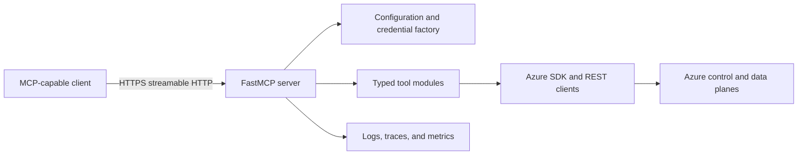

# Azure Cloud Intelligence MCP: Specification And Delivery Plan

## Status

Phase 1, Phase 2, and the Phase 3 implementation/review gates are completed. Production enablement remains conditional on a disposable controlled-action run and verified Foundry adapter configuration.

## 1. Product Specification

### 1.1 Objective

Deliver an Azure Cloud Intelligence MCP server that enables approved MCP clients to discover,
inspect, diagnose, and safely manage Azure resources through typed tools. The first release proves
the end-to-end path with read-only tools; controlled actions are introduced only after safety,
validation, and audit foundations exist.

### 1.2 In Scope

- A Python 3.11+ MCP server using streamable HTTP and the `/mcp` endpoint.
- Azure authentication through `DefaultAzureCredential` locally and Managed Identity in hosted
  environments, with narrowly scoped service-principal support where needed.
- Azure resource discovery, health/diagnostic queries, and controlled management operations.
- Tool domains from the approved inventory: resource management, VMs, storage, networking, Key
  Vault, monitoring, cost, Azure OpenAI/AI Foundry, AKS, Functions, SQL, Cosmos DB, and Azure ML.
- Structured logs, telemetry, audit-safe records, tests, containerization, and Azure deployment.

### 1.3 Out Of Scope For This Plan

- Autonomous remediation or scheduled actions without explicit later approval.
- Multi-cloud support, a general plugin marketplace, and broad Infrastructure-as-Code generation.
- Returning secret values, access tokens, or connection strings by default.
- A general-purpose conversational UI; the MCP client owns the conversational experience.

### 1.4 Functional Requirements

1. The server supports MCP initialization, tool discovery, and tool calls over streamable HTTP.
2. Tools expose typed input schemas, human-readable descriptions, and JSON-serializable results.
3. The MVP provides `list_resource_groups`, `list_virtual_machines`, and
   `list_storage_accounts` against the configured subscription.
4. Each later tool maps to a minimum Azure RBAC role and fails safely on invalid input, missing
   resources, throttling, timeout, or authorization failure.
5. Controlled actions require client approval plus server-side validation before Azure is called.
6. Long-running Azure operations do not block indefinitely and expose progress or an operation
   reference where the MCP transport supports it.
7. A diagnostic capability combines trusted Azure observations, such as VM state, Monitor data,
   and Advisor recommendations, into a traceable summary.

### 1.5 Non-Functional Requirements

- **Security:** TLS remotely; least-privilege RBAC; Key Vault or deployment secret store; input
  validation; redacted telemetry; no credentials in source control.
- **Reliability:** explicit timeouts; retries for safe transient failures; sanitized errors; health
  checks; stateless service design.
- **Observability:** structured logs, correlation IDs, traces, call volume, latency, error rate,
  and controlled-action outcome metrics.
- **Quality:** typed Python, Pydantic validation, linting, type checking, unit tests with mocked
  Azure clients, MCP protocol tests, and opt-in integration tests.
- **Scalability:** container-ready design suitable for Azure Container Apps first; AKS only when
  its operational requirements are justified.

### 1.6 Architecture And Contracts

- `src/config.py`: validated settings and environment loading.
- `src/auth.py`: credential selection; no secret logging.
- `src/azure_clients.py`: Azure SDK factories with timeouts and retry policies.
- `src/tools/`: one module per Azure domain.
- `src/utils/`: validation, error mapping, redaction, pagination, and controlled-action helpers.
- `src/monitor.py`: logging and OpenTelemetry setup.
- `tests/`: unit, protocol, and opt-in integration coverage.

Every tool contract includes a stable name, typed input, output shape, safety class, minimum RBAC,
sanitized errors, and test cases. A tool can be added only after its contract is documented.

### 1.7 Tool Safety Classes

| Class | Examples | Required controls |
| --- | --- | --- |
| Read-only | list resource groups, VM state, metrics | Input validation, least privilege, bounded result size, audit-safe logs |
| Controlled action | create storage account, start VM, deploy model | Client approval, target/scope validation, RBAC mapping, audit record, idempotency/existence check |
| Sensitive data | secret retrieval, SQL/Cosmos queries, logs containing customer data | Explicit authorization, response minimization/redaction, query constraints, enhanced audit review |

### 1.8 Dependency Order

`Repository setup` -> `configuration and identity` -> `MCP host and protocol tests` ->
`read-only MVP` -> `cross-cutting safety and telemetry` -> `controlled service tools` ->
`diagnostics` -> `production deployment`.

No phase starts until the preceding phase's exit criteria are met.

## 2. Phased Implementation

## Phase 0: Repository And Environment Baseline

**Goal:** Establish a reproducible local workspace without creating Azure resources.

### Tasks

- Create the source, test, documentation, and CI directory structure described in the architecture.
- Create `.gitignore`, `.env.example`, dependency definition, formatting/lint/type-check settings,
  and a Python 3.11+ virtual environment workflow.
- Confirm Azure CLI login and explicitly select a development subscription.
- Record local credentials as Azure CLI-based `DefaultAzureCredential`; do not create or store a
  client secret for the MVP.
- Add a `README.md` quick start and the initial ADR/decision record structure.

### Acceptance Criteria

- A clean checkout can create an isolated environment and install pinned/bounded dependencies.
- `.env`, virtual environments, test artifacts, and secrets are ignored.
- No Azure credential or subscription identifier is committed.

### Verification

- Run environment setup and the selected formatter, linter, and type-check commands.
- Run `az account show` manually and confirm it identifies the intended non-production scope.

## Phase 1: MCP Host And Read-Only MVP

**Goal:** Prove the smallest complete path from an MCP client to Azure and back.

### Phase 1 Tasks

- Implement validated configuration, credential factory, and shared Resource, Compute, and Storage
  management clients.
- Implement `list_resource_groups`, `list_virtual_machines(resource_group)`, and
  `list_storage_accounts(resource_group)` as read-only tools.
- Implement the FastMCP application, `/mcp` streamable-HTTP endpoint, and a health endpoint.
- Add common Azure-exception translation, result pagination/bounds, and redacted structured logs.
- Add MCP protocol tests for initialize, tools/list, and tools/call; add unit tests that mock Azure
  SDK clients.
- Document a local HTTPS exposure path for development and a separate production connection model.

### Phase 1 Acceptance Criteria

- Tool discovery exposes all three tools with valid schemas and non-empty descriptions.
- Each tool returns normalized, JSON-serializable output or a sanitized actionable error.
- A local MCP client can execute all three tools against mocked data; an opt-in Azure check proves at
  least one read-only call against the chosen development subscription.

### Phase 1 Verification

- Run unit tests, MCP protocol tests, linting, and type checking.
- Run the server locally, scan tools through the selected MCP client, and execute a read-only query.

## Checkpoint A: MVP Review

- [x] Read-only end-to-end flow works through the MCP transport.
- [x] No secrets are present in source code, logs, or tool output.
- [x] The MVP has only reader-level permissions in the development scope.
- [x] Architecture, setup, and tool documentation reflect implemented behavior.

## Phase 2: Cross-Cutting Safety, Audit, And Reliability

**Goal:** Build the safeguards before adding write operations or sensitive data access.

### Phase 2 Tasks

- Add Pydantic request models and reusable validation for Azure identifiers, scopes, resource IDs,
  page sizes, and locations.
- Add a controlled-action policy that integrates the current MCP SDK/client approval mechanism;
  verify this behavior against current official MCP and client documentation.
- Add a tool registry or metadata convention containing safety class, minimum RBAC, owner module,
  and documentation reference.
- Configure Azure SDK timeouts and retry policies for safe transient operations.
- Add audit-safe logging, redaction, correlation IDs, OpenTelemetry traces, and tool-level metrics.
- Publish the RBAC mapping and data-handling policy; decide and document retention requirements.

### Phase 2 Acceptance Criteria

- A controlled-action test proves Azure is not called without the required approval/policy result.
- Logs redact secret-like fields and record tool name, target context, duration, outcome, and trace ID.
- Tests cover validation, authorization failure, throttling, timeout, and unexpected Azure SDK error
  paths.

### Phase 2 Verification

- Run the unit and protocol suites, including retry and redaction tests.
- Review representative logs from read-only and simulated controlled-action calls.

## Phase 3: Core Service Tools In Vertical Slices

**Goal:** Add high-value Azure domains one tested slice at a time.

### Slice 3.1: Compute And Storage

- Add VM status/start/stop and storage account create/blob transfer tools.
- Mark start, stop, create, and upload operations as controlled actions.

### Slice 3.2: Networking And Key Vault

- Add VNet, NSG, and public-IP inspection/creation tools.
- Add Key Vault metadata operations first. Do not expose secret values until the sensitive-data
  contract, redaction behavior, and explicit authorization controls pass review.

### Slice 3.3: Monitoring And Cost

- Add Log Analytics query, metrics, cost summary, and Advisor recommendation tools.
- Constrain query tools to approved read-only forms and bounded time windows/results.

### Slice 3.4: Azure AI Management

- Add Azure OpenAI deployment discovery and controlled deployment tools.
- Add AI Foundry agent discovery and controlled lifecycle tools only after their current APIs and
  RBAC roles are verified from official documentation.

### Acceptance Criteria For Every Slice

- Tool contracts, minimal RBAC, safety class, happy path, and at least one failure path are documented
  and tested.
- A development-scope manual check validates one representative Azure call without affecting
  production resources.
- Controlled actions show intended target and require approval before execution.

### Phase 3 Verification

- Run focused unit/protocol tests after each slice, then the full Phase 1-3 suite at phase end.
- Check redacted audit logs and expected Azure Activity Log entries for one controlled action.

## Checkpoint B: Service Coverage Review

- [x] All implemented write tools have an approval, RBAC, audit, and rollback/failure story.
- [x] Data-plane and secret-sensitive tools have separate threat-model review evidence.
- [x] No tool grants or requires a broader Azure role than documented.

## Phase 4: Advanced Azure Domains And Diagnostics

**Goal:** Complete the approved advanced domain inventory and add evidence-based diagnostics.

### Phase 4 Tasks

- Implement AKS cluster/pod inspection, Functions inventory/log retrieval, Azure SQL database
  inventory with constrained query support, Cosmos inventory/query support, and Azure ML
  model/pipeline tools.
- Build `diagnose_vm_issue` or equivalent as a transparent aggregator of VM state, bounded Monitor
  data, and Advisor recommendations. Its result must distinguish observations from inferences.
- Add opt-in integration tests using isolated test resources and synthetic failure scenarios.
- Evaluate OAuth/token validation for shared or multi-tenant deployment; implement it only if the
  deployment model requires it and document the authorization boundary.

### Phase 4 Acceptance Criteria

- The diagnostic tool identifies its data sources, time window, incomplete evidence, and recommended
  next action without fabricating causes.
- SQL, Cosmos, and log-query tools are read-only and enforce result/time/query constraints.
- Advanced domains have unit tests and isolated integration coverage where a test resource exists.

### Phase 4 Verification

- Execute diagnostic tests using deterministic mocked Azure responses.
- Run opt-in integration checks against dedicated non-production resources.

## Phase 5: Production Deployment And Operations

**Goal:** Deliver a repeatable, observable Azure-hosted service.

### Phase 5 Tasks

- Build a multi-stage container image that runs as a non-root user with a health endpoint.
- Deploy first to Azure Container Apps with Managed Identity, Key Vault-backed configuration, TLS,
  explicit ingress, and autoscaling rules. Reassess AKS only if Container Apps cannot meet an
  established requirement.
- Create CI for formatting, linting, type checks, unit/protocol tests, dependency/security checks,
  and container build.
- Create CD to publish to Azure Container Registry and deploy an approved image version.
- Export telemetry to Application Insights/Azure Monitor; define dashboards and alerts for error
  rate, latency, availability, and controlled-action failures.
- Run load and resilience tests for concurrent MCP sessions and bounded streaming behavior.
- Publish deployment, incident response, rollback, and connector setup runbooks.

### Phase 5 Acceptance Criteria

- Production uses Managed Identity and contains no long-lived Azure credential in application settings.
- CI blocks merges on failing quality gates; deployment is repeatable from versioned source.
- An operator can detect a failed tool call, locate its redacted trace, and roll back a bad release.

### Phase 5 Verification

- Validate a deployment to a non-production Azure environment.
- Simulate a tool failure and verify telemetry, alert routing, and rollback procedures.
- Run the production MCP connector against read-only tools before enabling controlled actions.

## Phase 6: Deferred Backlog

Do not start these items without a new approved specification: multi-cloud connectors, Azure Policy
preflight checks, Bicep/ARM generation and apply workflows, scheduled or autonomous actions, and a
third-party plugin ecosystem.

## 3. Delivery Risks And Mitigations

| Risk | Mitigation |
| --- | --- |
| Excessive Azure permissions | Scope identities to resource groups; document minimum role per tool; separate read and action identities when needed. |
| Accidental destructive action | Approval plus server-side validation, target disclosure, audit logging, and idempotency/existence checks. |
| Secrets in responses or logs | Default-deny secret output; field-level redaction tests; Key Vault/deployment secret store only. |
| MCP or client API changes | Pin compatible versions; verify transport and approval APIs from current official docs before implementation. |
| Azure SDK inconsistencies | Wrap SDK calls in focused clients; mock SDK behavior; use explicit error mapping and timeouts. |
| Unbounded data queries | Validate query language subset, time range, page size, result size, and permitted scopes. |
| Production complexity too early | Prove a read-only MVP locally, then deploy to Container Apps before considering AKS. |

## 4. Phase Completion Record

For each completed phase, record the date, commit/PR reference, verification evidence, deployed
environment (if any), residual risks, and a decision to proceed to the next phase. Keep this section
updated rather than creating a parallel plan.

| Phase | Status | Evidence | Residual Risk |
| --- | --- | --- | --- |
| 0 | Not started | - | - |
| 1 | Completed (2026-09-21) | Read-only MCP tools implemented, protocol and unit tests passing, smoke checks passing, docs and tunnel guidance completed, compileall and diagnostics clean | Local compatibility shims are used for missing external Azure/pytest packages in this policy-restricted environment |
| 2 | Completed (2026-09-21) | Added Pydantic validation models, tool metadata registry, controlled-action policy foundations, timeout guard, RBAC/data-handling documentation, redaction utilities, structured audit logging with target context + safety class + error code, and expanded policy/validation/error-path/monitor tests (24 tests passing). Verification evidence documented in docs/phase2-verification.md | Controlled-action policy is scaffolding only until write/action tools are introduced |
| 3 | Completed (implementation/review, 2026-09-21) | Added all four service slices, passed the 55-test suite, completed compile/smoke/diagnostic checks, performed live read-only subscription/resource validation, queried historical Activity Log evidence, and completed Checkpoint B review in docs/checkpoint-b-review.md | Production enablement still requires an operator-approved disposable controlled-action run with matching Activity Log evidence and a verified live Foundry adapter configuration |
| 4 | Not started | - | - |
| 5 | Not started | - | - |
| 6 | Deferred | - | Requires separate approval |
